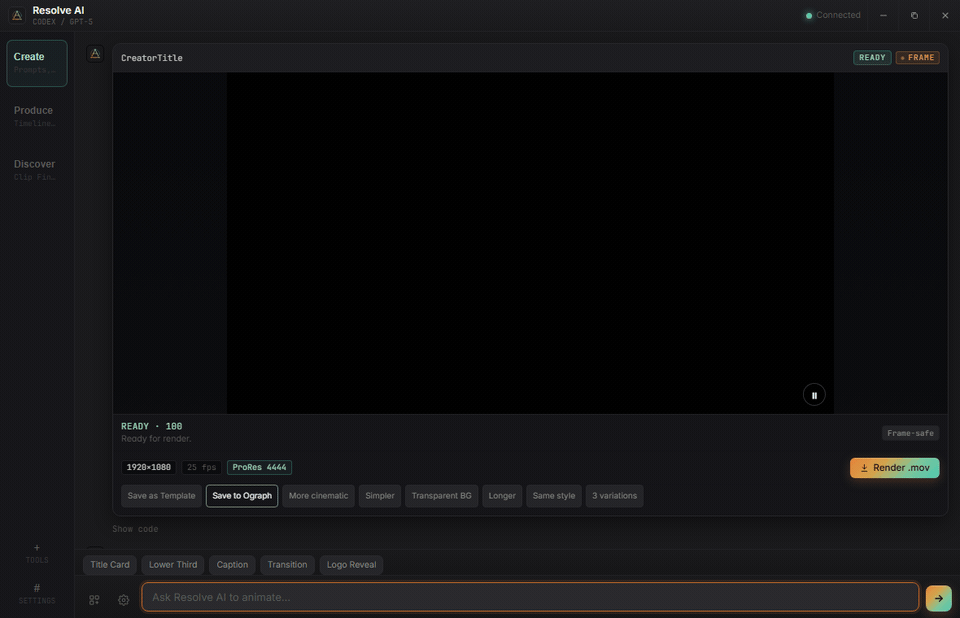
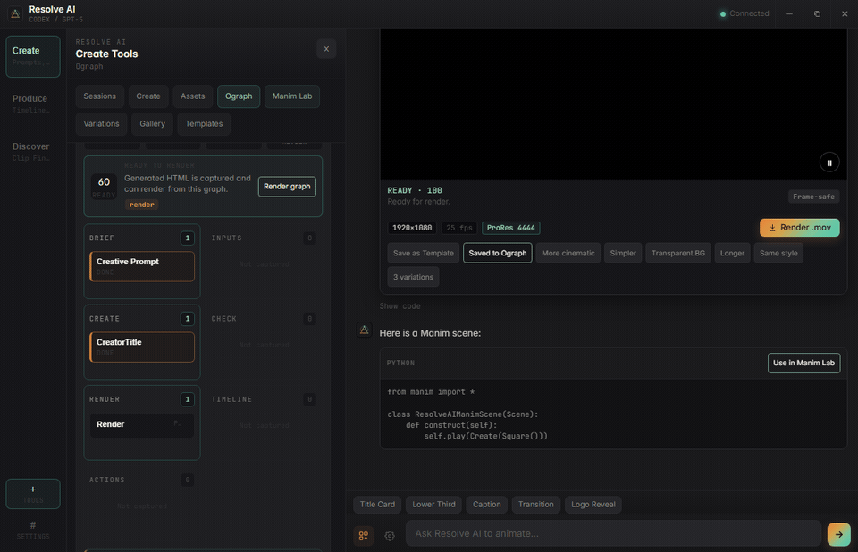

# Resolve AI

**AI motion graphics inside DaVinci Resolve.**

Resolve AI is a creator-focused DaVinci Resolve Studio Workflow Integration Plugin. It helps you generate motion graphics, preview them, render overlays, organize reusable templates, work with assets, and hand off ideas between chat, Ograph, Manim Lab, timeline tools, captions, and clip discovery workflows.

This is an independent fork of [Claude Resolve](https://github.com/olegkupshukov/claude-resolve). It keeps Claude compatibility and adds OpenAI Codex support, provider-neutral UI, render reliability work, project sessions, Ograph, Manim Lab, prompt galleries, asset-aware generation, and creator workflow tools.

Repository: [s4lam/resolve-ai](https://github.com/s4lam/resolve-ai)

## Demos

**Workspace flow: chat result → Ograph → Manim Lab → Produce tools**



**Ograph + Manim Lab: turn a motion graph into a Manim brief, render, and save back to Ograph**



## Why Use It

- **Works with Claude and Codex**: choose Claude Code, OpenAI Codex CLI, or Auto.
- **Built for Resolve workflows**: generate, preview, render, add to timeline, and reuse outputs without leaving Resolve.
- **Workspace UI**: Create, Produce, and Discover modes keep tools grouped by actual editing tasks.
- **Ograph**: a local motion workflow graph for prompts, assets, generated HTML, validation, renders, timeline state, actions, and Manim handoffs.
- **Manim Lab**: optional local Manim workflow for diagrams, equations, educational explainers, and technical visuals.
- **Render presets**: ProRes MOV, CPU MP4 Quality, and GPU MP4 Quality with fallback checks.
- **Asset-aware prompts**: attach logos, product images, textures, backgrounds, icons, and references.
- **Sessions**: keep chat/project history separated by Resolve project and timeline.
- **Prompt Gallery + Templates**: reusable local prompts and community template packs.
- **AI Clip Finder**: transcript-first long-form-to-Shorts candidate discovery with review before timeline creation.
- **Caption Studio 2.0**: import transcripts, regroup phrases, edit captions, generate transparent 9:16 overlays, or use feature-gated native Resolve Text+ captions.
- **Local-first storage**: assets, templates, renders, transcripts, sessions, and Ograph state stay on your machine.

## Requirements

- **DaVinci Resolve Studio 21+**. Workflow Integration Plugins require the Studio edition.
- **Windows or macOS**.
- **Node.js 18+** for source installs. Release installers can help repair missing dependencies.
- One or both AI CLIs:
  - [OpenAI Codex CLI](https://developers.openai.com/codex/cli)
  - [Claude Code CLI](https://claude.ai/claude-code)
- Optional local transcription:
  - OpenAI Whisper CLI
  - whisper.cpp / `whisper-cli` with a configured model path

Resolve AI uses CLI auth. It does not ask for or store OpenAI or Anthropic API keys in the app.

## Install

### Recommended: GitHub Release ZIP

1. Download the latest release ZIP:
   - Windows: `ResolveAI-Windows-vX.Y.Z.zip`
   - macOS: `ResolveAI-macOS-vX.Y.Z.zip`
2. Extract the ZIP.
3. Run the installer:
   - Windows: double-click `Install Resolve AI.bat`
   - macOS: double-click `Install Resolve AI.command`
4. Restart DaVinci Resolve for first install, or reopen the plugin after an in-app update.
5. Open **Workspace > Workflow Integration > Resolve AI**.

Download the ZIP asset from the GitHub Release page, not GitHub's automatic **Source code** ZIP. Source ZIPs do not include the built `plugin/dist` files and will fail installer verification.

The release root intentionally shows one launcher per platform. Internal scripts live in `installer/`; normal users should not run them directly.

The installer preserves existing settings, renders, assets, sessions, templates, and legacy `com.clauderesolve.plugin` compatibility paths. It repairs required render dependencies and attempts to install optional local tools into Resolve AI's app-managed tools folder: Codex CLI, Claude Code CLI, Manim, and Whisper. Provider login still stays manual with `codex login` or `claude login`.

### Install From Source

```bash
npm --prefix plugin install
npm --prefix plugin run build
```

Then run the platform installer:

```bash
# Windows
"Install Resolve AI.bat"
```

```bash
# macOS
bash "Install Resolve AI.command"
```

If macOS Gatekeeper blocks a downloaded source folder:

```bash
xattr -dr com.apple.quarantine .
chmod +x "Install Resolve AI.command" installer/install.sh
bash "Install Resolve AI.command"
```

Source installs are mainly for contributors. Normal users should use the release ZIP.

## Updating

Open **Settings > App** and click **Update Resolve AI**.

The updater downloads the correct release ZIP, validates it, stages it locally, closes only the Resolve AI plugin window, installs the new plugin files, and asks you to reopen **Workspace > Workflow Integration > Resolve AI**. DaVinci Resolve itself can stay open, but the plugin window must close during file replacement.

If an update fails, Resolve AI keeps the old plugin backup and Settings > App provides **Copy update diagnostics** for bug reports.

## Provider Setup

Install and log in to at least one provider CLI.

```bash
npm install -g @openai/codex
codex login
```

```bash
npm install -g @anthropic-ai/claude-code
claude login
```

Inside Resolve AI, open **Settings > Provider** and choose `Auto`, `Codex`, or `Claude`.

On first run, open **Settings > Setup**. It separates required core checks from optional tools:

- required: AI provider login, render engine, updater status;
- optional: Motion Diagram / Manim and local transcription.

Missing optional tools do not mean the plugin is broken.

## Main Workflows

### Create

Use natural language, prompt presets, brand kit, and selected assets to generate title cards, lower thirds, captions, transitions, logo reveals, product graphics, social overlays, and technical scenes.

Example:

```text
Create a clean 5 second creator title card with a dark transparent-safe background, crisp central text, subtle line animation, and ProRes 4444 overlay output. 1920x1080, 25fps.
```

### Ograph

Ograph turns a result into a reusable local workflow graph. A graph can contain:

- creative prompt
- session context
- attached assets
- generated HTML
- validation state
- render state
- timeline state
- follow-up action prompts
- Manim source or Manim brief handoffs

Useful Ograph actions:

- **Save to Ograph** from any completed chat render card.
- **Capture latest result** from the Ograph panel.
- **Render graph** to render the selected HTML output.
- **Use as Manim brief** to turn the graph into a Manim Lab scene idea.
- **Open in Manim Lab** to reopen saved Manim source.
- **Add at Playhead** to place a rendered output back into Resolve when available.

### Manim Lab

Manim Lab is optional. It is for deterministic local Python animation scenes, especially:

- diagrams
- equations
- explainers
- process visuals
- educational motion graphics
- technical product visuals

Workflow:

1. Build a Manim prompt from an idea, latest overlay, or Ograph brief.
2. Paste/review generated Python source.
3. Validate source.
4. Render locally when Manim is installed.
5. Save draft/render back to Ograph.
6. Add rendered MP4 to the timeline when Resolve allows it.

Required generated class name:

```python
class ResolveAIManimScene(Scene):
    ...
```

### Produce

Produce tools focus on timeline-aware work:

- timeline context
- lower thirds and title at playhead
- captions and vertical-safe subtitle overlays
- render history
- render settings
- sync/reveal/add render outputs

### Discover

Discover tools are for long-form editing helpers:

- **AI Clip Finder**: import SRT/VTT/timestamped TXT or generate a local transcript with Whisper when configured. It scores standalone short-form candidates, lets you review/select them, then creates one timeline per selected Short.
- **Short subtitles**: use **Caption this** on any selected candidate to open Caption Studio with that Short's transcript slice. Caption cues are offset to start at `0`, so timing matches the new Short timeline.
- **Caption Studio**: regroup captions as whole sentences, punchy short-form phrases, karaoke highlights, single words, or custom phrase lengths. Default output is transparent overlay HTML/ProRes. Native Resolve Text+ output is advanced and only enables when `fuscript` and a Media Pool caption template named `Resolve AI Caption` are available.
- **AI Rough Cut**: generate reviewed keep ranges from timestamped transcript chunks, then create a non-destructive stitched timeline.

The plugin does not auto-upload anywhere. It prepares local timelines, metadata, captions, and render packages.

Subtitle fit rules for Shorts:

- 9:16 canvas defaults to `1080x1920`.
- Captions stay inside `x 7%-93%` and `y 12%-86%`.
- Vertical captions are limited to 2 visible lines with short balanced line lengths.
- Prompts require responsive font sizing, transparent backgrounds, and no clipped or edge-touching words.
- Native Text+ captions remain editable inside Resolve, but require a trusted Text+ template in the Media Pool.

## Render Presets

| Preset | Best For | Notes |
| --- | --- | --- |
| ProRes MOV | Transparent overlays | Uses `prores_ks`; recommended default for Resolve overlays. |
| CPU MP4 Quality | High-quality non-alpha exports | Uses `libx264`; works on most machines. |
| GPU MP4 Quality | Faster HEVC MP4 when supported | Windows uses NVIDIA NVENC when available; macOS uses VideoToolbox when available. Falls back to CPU MP4 if unsupported. |

MP4 does not preserve alpha. Use ProRes MOV for transparent overlays.

## Render Reliability

Resolve can launch plugins with a stripped `PATH`, so relying on system FFmpeg can fail. Resolve AI now resolves FFmpeg in this order:

1. user-configured FFmpeg path
2. renderer-local `ffmpeg-static`
3. known Homebrew/winget/system paths
4. shell lookup fallback

Settings > Diagnostics includes render health:

- FFmpeg path/version
- ProRes and H.264 encoder checks
- optional GPU encoder checks
- render folder writability
- Playwright Chromium check
- last render error

It also includes a Resolve capability report for scripting-dependent workflows:

- selected Media Pool clip access
- current timeline access
- timeline creation/append support
- review marker support
- Resolve render-setting probes
- transcription and native Text+/Fusion availability

If a capability is unavailable, Resolve AI shows the fallback instead of failing silently.

`ffmpeg-static` downloads platform FFmpeg binaries during dependency install. Those binaries have their own FFmpeg licensing terms.

## Privacy And Safety

- Media files stay local unless you explicitly export or upload them.
- Assets, templates, Ographs, render history, sessions, transcripts, media analysis reports, and timeline safety snapshots are stored locally.
- Transcript text and prompts may be sent to the selected AI provider when you ask the AI to process them.
- Local Whisper transcription stays on your machine when you use a local Whisper or whisper.cpp command.
- Source-safe media analysis reads media metadata and writes Resolve AI sidecar reports only. It does not modify, transcode, proxy, relink, or overwrite source media.
- Provider auth depends on the configured CLI.
- Screenshots/media previews are not sent unless a workflow explicitly enables that behavior.
- Manim Lab validates source before running and blocks unsafe imports/system access patterns.
- Ograph and template pack imports are local-first by default.

## Troubleshooting

- **Installer says `missing: dist/index.html`**: you probably downloaded GitHub's **Source code** ZIP. Download `ResolveAI-Windows-vX.Y.Z.zip` or `ResolveAI-macOS-vX.Y.Z.zip` from the Release assets.
- **Installer says `missing: data/builtin-template-packs.json`**: download the latest release ZIP asset, not Source code, then rerun the installer.
- **macOS says unidentified developer**: right-click `Install Resolve AI.command`, choose **Open**, then confirm.
- **macOS double-click does not open**: run `bash "Install Resolve AI.command"` from Terminal once. The launcher will repair executable bits for future runs.
- **Plugin path is not a directory**: rerun the latest installer. It backs up the bad file/path automatically before copying the plugin.
- **Permission denied on macOS**: the installer uses `sudo` only for the `/Library/Application Support/Blackmagic Design/...` plugin folder. Rerun the installer from an extracted folder, not directly inside the ZIP preview.
- **Render fails with FFmpeg errors**: open Settings > Diagnostics and run the render engine check. Source installs can run `npm --prefix plugin run render-deps:check`.
- **Not sure what is missing**: open Settings > Setup. It shows required items separately from optional Manim/Whisper tools.
- **Need system FFmpeg fallback**: macOS `brew install ffmpeg`; Windows `winget install Gyan.FFmpeg`.
- **Render does nothing on macOS**: update to the latest release and use Settings > Diagnostics. Render failures should now show visible errors.
- **Update failed**: open Settings > App and use **Copy update diagnostics**. The old plugin is restored from backup when install replacement fails.
- **Codex or Claude login fails**: run `codex login` or `claude login` in Terminal, then reopen Resolve AI.
- **Codex shows noisy skill/config warnings**: those are filtered from chat where possible. Fix invalid local Codex skills/config if they block the CLI.
- **Ograph is empty**: generate an overlay and click **Save to Ograph**, or open Ograph and click **Capture latest result**.
- **Manim Lab says setup needed**: run the latest release installer again, or open Settings > Setup and click **Install / Repair Everything**. Resolve AI installs Manim and Whisper into its own local tools folder when Python is available.
- **Motion Diagram / Manim is optional**: failed Manim or Whisper setup does not break normal overlay rendering. The repair action opens visible terminal output so you can see the exact command and error.
- **Codex says `gpt-5.3-codex` is not supported**: update to the latest release. Resolve AI now passes `--model gpt-5.5` on both fresh and resumed Codex turns so the CLI cannot fall back to the unsupported ChatGPT-auth default. You can also choose `GPT-5.4 Mini` in Settings > Provider.
- **AI Clip Finder cannot create timelines**: select exactly one Media Pool video clip and import a timestamped transcript. Untimestamped TXT cannot create frame-accurate cuts.
- **Whisper is not ready**: install Whisper or whisper.cpp, then configure the command/model path in Settings. SRT/VTT import still works without Whisper.
- **Short subtitles look too wide**: use the Shorts Studio **Caption this** flow rather than a generic caption prompt. It uses 1080x1920 and vertical safe-area rules.
- **Native Text+ is unavailable**: import or create a Text+ caption template in the Media Pool named exactly `Resolve AI Caption`, and make sure Resolve's `fuscript` binary exists. Transparent overlay captions still work without this advanced path.
- **MP4 is not transparent**: use ProRes MOV.

## Development

Run checks:

```bash
npm --prefix plugin test
npm --prefix plugin run build
npm --prefix plugin run smoke
npm --prefix plugin run smoke:visual
npm --prefix plugin run render-deps:check
```

Package release ZIPs:

```bash
npm --prefix plugin run validate:release
npm --prefix plugin run package:release
```

`package:release` validates each ZIP after extraction and fails if required files such as `plugin/dist/index.html`, `plugin/data/builtin-template-packs.json`, or updater helper scripts are missing.

Regenerate README GIFs:

```bash
npm --prefix plugin run build
npm --prefix plugin run media:readme
```

Generated media is written to `docs/media/`.

## Release Checklist

Before publishing a GitHub Release:

1. Run tests/build/smoke/package checks.
2. Install from a clean release ZIP on Windows.
3. Install from a clean release ZIP on macOS.
4. Open Resolve AI inside DaVinci Resolve Studio.
5. Test Codex and Claude provider states.
6. Render ProRes MOV.
7. Test Ograph save/open/render.
8. Test Manim Lab setup detection and source validation.
9. Test AI Clip Finder caption prompts for selected Shorts at 1080x1920.
10. Confirm existing user config, renders, assets, sessions, and templates survive update.

## Contributing

Contributions are welcome, especially:

- universal template packs
- prompt gallery examples
- render reliability fixes
- macOS installer testing
- Resolve API compatibility notes
- Ograph workflow ideas
- Manim starter scenes
- accessibility and compact UI improvements

Keep built-in examples universal for creators, podcasts, gaming, education, business, sports, music, social shorts, documentaries, products, and events.

Do not commit API keys, tokens, local credentials, private media, or personal paths.

## Compatibility Notes

- Visible product name: **Resolve AI**.
- Legacy plugin ID and some local folder paths remain compatible with Claude Resolve installs.
- DaVinci Resolve Workflow Integration APIs vary by version/platform, so Resolve calls are defensive and may show unavailable states.
- Direct native IntelliScript automation is feature-detected only. AI Clip Finder and AI Rough Cut use normal non-destructive Resolve scripting paths where available.

## Credits

Resolve AI is based on [Claude Resolve](https://github.com/olegkupshukov/claude-resolve) by olegkupshukov.

## License

See [LICENSE](LICENSE).
