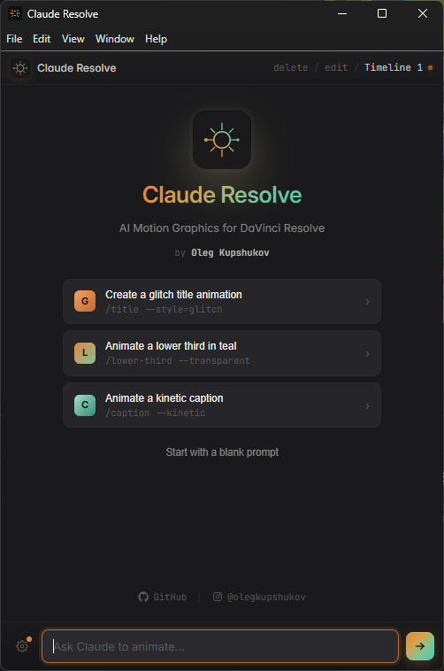
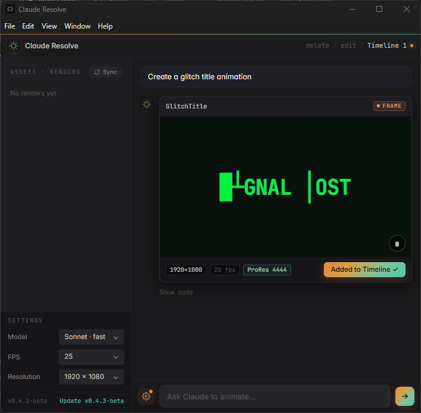

# Claude Resolve (v0.5.0-beta)

**AI Motion Graphics Generator for DaVinci Resolve Studio**
*by Oleg Kupshukov*

Claude Resolve is a Workflow Integration Plugin that brings AI-powered motion graphics generation directly into DaVinci Resolve Studio. Describe what you want in plain text, and Claude generates the animation code, renders it to ProRes 4444 with alpha transparency, and imports it to your timeline.





## Requirements

- **DaVinci Resolve Studio 21+** (not the free version — Workflow Integration Plugins require Studio)
- **Node.js 18+** — required by the Claude Code CLI
- **Claude Code CLI** with an active Pro or Max subscription
- **ffmpeg** in PATH
- **Windows** or **macOS**

Check your Node.js version:

```
node --version    # must be v18 or newer
```

On macOS, if it's older than 18, upgrade with `brew install node` (latest) or `fnm install 22`.

## Installation

### Windows
1. Download or clone the repo
2. Double-click `install.bat`
3. Restart DaVinci Resolve

### macOS
1. Download or clone the repo
2. Double-click `install.command`
   - **"unidentified developer"?** Right-click `install.command` → **Open**, then confirm.
   - **Double-click does nothing / "permission denied"?** A ZIP download strips the executable bit. Open Terminal in the repo folder and run `bash install.command` (it restores the bit), or `chmod +x install.command`.
   - **Still blocked by Gatekeeper?** Clear the quarantine flag in the repo folder: `xattr -dr com.apple.quarantine .`
3. Restart DaVinci Resolve

The installer checks for DaVinci Resolve and Node.js, installs the Claude Code CLI and the renderer's dependencies (Playwright + Chromium), and copies the plugin into Resolve. After installing, open the plugin from **Workspace > Workflow Integration > Claude Resolve**.

## Usage

1. Open the plugin in DaVinci Resolve
2. Type a prompt describing the motion graphic you want
3. Preview the result in the built-in player
4. Click **Render .mov** to render it and import it to your timeline

## How it works

Generates one-off HTML animations rendered frame-by-frame to ProRes 4444 .mov with alpha transparency via Playwright + ffmpeg. Full creative freedom: CSS animations, SVG, Canvas, filters, blur, backdrop-filter. The rendered .mov is automatically imported to your current timeline on an empty track at the playhead position.

**Use it for:** title cards, text reveals, glitch effects, lower thirds, transitions — any specific animation for the project at hand.

## Settings

Open the sidebar (gear icon) to configure:

- **Model**: Sonnet (fast) or Opus (smart)
- **FPS**: 24, 25, 30, or 60
- **Resolution**: 1920×1080, 3840×2160, 1080×1920, 1080×1350, or 1080×1080
- **Assets**: Manage rendered .mov files (sync to Media Pool, delete)

## Bundled Fonts

The plugin ships with a curated set of fonts so generated animations look consistent across machines without extra installs:

- **Bricolage Grotesque**
- **Fraunces**
- **JetBrains Mono**

## Known Limitations

- Complex prompts may be slow on Sonnet — switch to Opus for better results on detailed animations
- The plugin spawns Claude Code CLI as a subprocess — first response may take a few seconds to warm up
- This is a beta — expect rough edges; please report issues on GitHub or Discord

Tested on Windows and macOS (Apple Silicon).

## Links

- [GitHub](https://github.com/olegkupshukov/claude-resolve)
- [Discord](https://discord.gg/95YrCyMgsK)
- [Instagram](https://instagram.com/olegkupshukov)

## License

MIT License. See [LICENSE](LICENSE) for details.

## Built With

- [Claude Code](https://claude.ai/claude-code) — AI engine
- [DaVinci Resolve Scripting API](https://www.blackmagicdesign.com/products/davinciresolve) — Resolve integration
- [React](https://react.dev) — Plugin UI
- [Playwright](https://playwright.dev) — Frame-perfect rendering
- [ffmpeg](https://ffmpeg.org) — ProRes 4444 encoding
